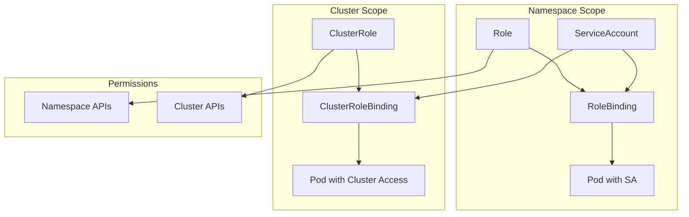

# RBAC (Role-Based Access Control)

RBAC components in Celestra provide fine-grained access control for your applications and users. They include ServiceAccounts, Roles, ClusterRoles, RoleBindings, and ClusterRoleBindings.

## Overview

RBAC components include:
- **ServiceAccount** - Identity for pods and applications
- **Role** - Permissions within a namespace
- **ClusterRole** - Cluster-wide permissions
- **RoleBinding** - Bind Role to users/groups/ServiceAccounts
- **ClusterRoleBinding** - Bind ClusterRole cluster-wide

## RBAC Architecture



## ServiceAccount

Service accounts provide an identity for processes running in pods.

### Basic Usage

```python
from src.k8s_gen import ServiceAccount

# Simple service account
sa = ServiceAccount("app-service-account")

# With additional configuration
sa = (ServiceAccount("backend-sa")
    .namespace("production")
    .automount_token(True)
    .add_image_pull_secret("registry-secret")
    .label("app", "backend"))
```

### Complete Example

```python
# Service account for a web application
web_sa = (ServiceAccount("web-app-sa")
    .namespace("web")
    .automount_token(True)
    .add_image_pull_secret("docker-registry")
    .add_image_pull_secret("private-registry")
    .label("component", "web")
    .annotation("description", "Service account for web application"))
```

## Role

Roles define permissions within a specific namespace.

### Basic Permissions

```python
from src.k8s_gen import Role

# Basic role with common permissions
app_role = (Role("app-role")
    .namespace("default")
    .allow_get("pods", "services", "configmaps")
    .allow_list("pods", "services")
    .allow_create("events")
    .allow_update("configmaps"))
```

### Advanced Permissions

```python
# Database role with specific permissions
db_role = (Role("database-role")
    .namespace("data")
    .add_rule(
        api_groups=[""],
        resources=["pods", "services"],
        verbs=["get", "list", "watch"]
    )
    .add_rule(
        api_groups=["apps"],
        resources=["deployments", "statefulsets"],
        verbs=["get", "list", "patch"]
    )
    .add_rule(
        api_groups=[""],
        resources=["secrets"],
        resource_names=["db-secret"],
        verbs=["get"]
    ))
```

### Custom Rules

```python
# Role with custom API groups and resources
monitoring_role = (Role("monitoring-role")
    .add_rule(
        api_groups=["metrics.k8s.io"],
        resources=["pods", "nodes"],
        verbs=["get", "list"]
    )
    .add_rule(
        api_groups=["monitoring.coreos.com"],
        resources=["servicemonitors", "prometheusrules"],
        verbs=["get", "list", "create", "update", "delete"]
    ))
```

## ClusterRole

ClusterRoles define cluster-wide permissions.

### System ClusterRole

```python
from src.k8s_gen import ClusterRole

# Cluster-wide monitoring role
monitoring_cluster_role = (ClusterRole("cluster-monitoring")
    .allow_get("nodes", "pods", "services")
    .allow_list("nodes", "pods", "services", "endpoints")
    .add_rule(
        api_groups=["metrics.k8s.io"],
        resources=["nodes", "pods"],
        verbs=["get", "list"]
    ))
```

### Admin ClusterRole

```python
# Platform admin role
admin_role = (ClusterRole("platform-admin")
    .add_rule(
        api_groups=[""],
        resources=["*"],
        verbs=["*"]
    )
    .add_rule(
        api_groups=["apps", "extensions"],
        resources=["*"],
        verbs=["*"]
    )
    .add_rule(
        api_groups=["rbac.authorization.k8s.io"],
        resources=["*"],
        verbs=["*"]
    ))
```

### Read-Only ClusterRole

```python
# Read-only access across cluster
readonly_role = (ClusterRole("readonly-access")
    .allow_get("*")
    .allow_list("*")
    .allow_watch("*")
    .add_rule(
        non_resource_urls=["/metrics", "/healthz", "/version"],
        verbs=["get"]
    ))
```

## RoleBinding

RoleBindings connect Roles to subjects (users, groups, service accounts) within a namespace.

### ServiceAccount Binding

```python
from src.k8s_gen import RoleBinding

# Bind role to service account
app_binding = (RoleBinding("app-role-binding")
    .namespace("default")
    .role("app-role")
    .bind_service_account("app-service-account", "default"))
```

### User and Group Binding

```python
# Bind to users and groups
team_binding = (RoleBinding("team-access")
    .namespace("development")
    .role("developer-role")
    .bind_user("john.doe@company.com")
    .bind_user("jane.smith@company.com")
    .bind_group("developers")
    .bind_group("qa-team"))
```

### Multiple Subjects

```python
# Complex binding with multiple subjects
complex_binding = (RoleBinding("complex-access")
    .namespace("production")
    .role("app-operator")
    .bind_service_account("app-sa", "production")
    .bind_service_account("monitoring-sa", "monitoring")
    .bind_user("admin@company.com")
    .bind_group("platform-team"))
```

## ClusterRoleBinding

ClusterRoleBindings provide cluster-wide access.

### System Binding

```python
from src.k8s_gen import ClusterRoleBinding

# Cluster-wide monitoring access
monitoring_binding = (ClusterRoleBinding("cluster-monitoring-binding")
    .cluster_role("cluster-monitoring")
    .bind_service_account("prometheus", "monitoring")
    .bind_service_account("grafana", "monitoring"))
```

### Admin Binding

```python
# Platform administrators
admin_binding = (ClusterRoleBinding("platform-admins")
    .cluster_role("platform-admin")
    .bind_user("admin@company.com")
    .bind_group("platform-team"))
```

## Complete RBAC Example

```python
#!/usr/bin/env python3
"""
Complete RBAC Setup for Microservices Platform
"""

from src.k8s_gen import (
    ServiceAccount, Role, ClusterRole, RoleBinding, ClusterRoleBinding,
    App, KubernetesOutput
)

def create_rbac_setup():
    # Service Accounts
    web_sa = (ServiceAccount("web-app-sa")
        .namespace("web")
        .automount_token(True)
        .add_image_pull_secret("registry-secret"))
    
    api_sa = (ServiceAccount("api-sa")
        .namespace("api")
        .automount_token(True)
        .add_image_pull_secret("registry-secret"))
    
    monitoring_sa = (ServiceAccount("monitoring-sa")
        .namespace("monitoring")
        .automount_token(True))
    
    # Namespace Roles
    web_role = (Role("web-app-role")
        .namespace("web")
        .allow_get("configmaps", "secrets")
        .allow_list("services", "endpoints")
        .allow_create("events"))
    
    api_role = (Role("api-role")
        .namespace("api")
        .allow_get("configmaps", "secrets", "services")
        .allow_list("pods", "services", "endpoints")
        .allow_create("events")
        .allow_update("configmaps")
        .add_rule(
            api_groups=[""],
            resources=["secrets"],
            resource_names=["api-secret", "db-secret"],
            verbs=["get"]
        ))
    
    # Cluster Roles
    monitoring_cluster_role = (ClusterRole("monitoring-reader")
        .allow_get("nodes", "pods", "services", "endpoints")
        .allow_list("nodes", "pods", "services", "endpoints", "namespaces")
        .add_rule(
            api_groups=["metrics.k8s.io"],
            resources=["nodes", "pods"],
            verbs=["get", "list"]
        )
        .add_rule(
            non_resource_urls=["/metrics"],
            verbs=["get"]
        ))
    
    readonly_cluster_role = (ClusterRole("readonly-access")
        .allow_get("*")
        .allow_list("*")
        .allow_watch("*"))
    
    # Role Bindings
    web_binding = (RoleBinding("web-app-binding")
        .namespace("web")
        .role("web-app-role")
        .bind_service_account("web-app-sa", "web"))
    
    api_binding = (RoleBinding("api-binding")
        .namespace("api")
        .role("api-role")
        .bind_service_account("api-sa", "api"))
    
    # Cluster Role Bindings
    monitoring_binding = (ClusterRoleBinding("monitoring-binding")
        .cluster_role("monitoring-reader")
        .bind_service_account("monitoring-sa", "monitoring"))
    
    readonly_binding = (ClusterRoleBinding("readonly-binding")
        .cluster_role("readonly-access")
        .bind_group("viewers")
        .bind_user("readonly@company.com"))
    
    # Applications using the service accounts
    web_app = (App("web-app")
        .image("web:latest")
        .service_account("web-app-sa")
        .namespace("web")
        .port(8080))
    
    api_app = (App("api")
        .image("api:latest")
        .service_account("api-sa")
        .namespace("api")
        .port(8080))
    
    return [
        # Service Accounts
        web_sa, api_sa, monitoring_sa,
        # Roles
        web_role, api_role,
        # Cluster Roles
        monitoring_cluster_role, readonly_cluster_role,
        # Bindings
        web_binding, api_binding, monitoring_binding, readonly_binding,
        # Applications
        web_app, api_app
    ]

if __name__ == "__main__":
    components = create_rbac_setup()
    
    output = KubernetesOutput()
    for component in components:
        output.generate(component, "rbac-setup/")
    
    print("✅ RBAC setup generated!")
    print("🚀 Deploy: kubectl apply -f rbac-setup/")
```

## Security Best Practices

!!! tip "RBAC Security Guidelines"
    
    **Principle of Least Privilege:**
    - Grant only necessary permissions
    - Use namespace-scoped roles when possible
    - Avoid wildcard permissions in production
    
    **Service Account Management:**
    - Create dedicated service accounts per application
    - Disable automounting when not needed
    - Use image pull secrets for private registries
    
    **Role Design:**
    - Group related permissions in roles
    - Use descriptive names and labels
    - Document role purposes with annotations
    
    **Binding Strategy:**
    - Prefer RoleBindings over ClusterRoleBindings
    - Review bindings regularly
    - Use groups for user management

## Common Patterns

### Development Environment

```python
# Permissive development setup
dev_role = (Role("dev-full-access")
    .namespace("development")
    .add_rule(api_groups=[""], resources=["*"], verbs=["*"])
    .add_rule(api_groups=["apps"], resources=["*"], verbs=["*"]))

dev_binding = (RoleBinding("dev-team-access")
    .namespace("development")
    .role("dev-full-access")
    .bind_group("developers"))
```

### Production Environment

```python
# Restricted production setup
prod_role = (Role("prod-app-access")
    .namespace("production")
    .allow_get("configmaps", "secrets")
    .allow_list("services")
    .allow_create("events"))

prod_binding = (RoleBinding("prod-app-binding")
    .namespace("production")
    .role("prod-app-access")
    .bind_service_account("app-sa", "production"))
```

### Monitoring Setup

```python
# Monitoring access pattern
monitoring_role = (ClusterRole("prometheus-reader")
    .allow_get("nodes", "nodes/proxy", "nodes/metrics", "services", "endpoints", "pods")
    .allow_list("nodes", "nodes/proxy", "nodes/metrics", "services", "endpoints", "pods")
    .add_rule(non_resource_urls=["/metrics"], verbs=["get"]))
```

## Troubleshooting

### Common RBAC Issues

!!! warning "Permission Denied"
    ```bash
    # Check current permissions
    kubectl auth can-i get pods --as=system:serviceaccount:default:app-sa
    
    # Debug role bindings
    kubectl describe rolebinding app-binding
    kubectl describe clusterrolebinding monitoring-binding
    
    # Check service account
    kubectl get serviceaccount app-sa -o yaml
    ```

!!! warning "Token Issues"
    ```bash
    # Check if token is mounted
    kubectl describe pod <pod-name> | grep -A 5 "Mounts:"
    
    # Verify service account token
    kubectl get secrets | grep app-sa
    ```

## API Reference

::: src.celestra.security.rbac
    options:
      show_source: false
      heading_level: 3

## Related Components

- **[SecurityPolicy](security-policy.md)** - Pod security policies
- **[Secret](secrets.md)** - Secret management
- **[App](../core/app.md)** - Using service accounts in apps

---

**Next:** Learn about [Secrets](secrets.md) for managing sensitive data. 