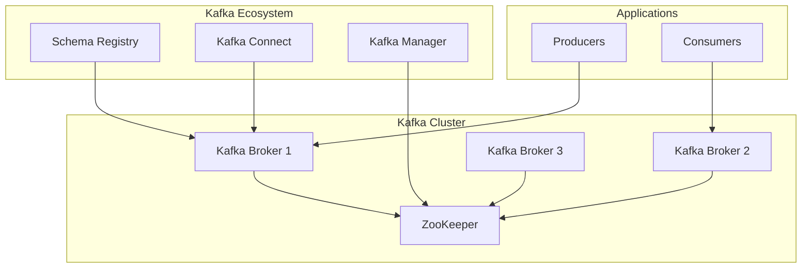

# Kafka Messaging Example

This example demonstrates how to deploy a production-ready Apache Kafka cluster using Celestra.

## Overview

Deploy a complete Kafka ecosystem including:
- **ZooKeeper ensemble** for coordination
- **Kafka brokers** for message streaming  
- **Schema Registry** for data schemas
- **Kafka Connect** for data integration
- **Monitoring** with JMX metrics

## Architecture



## Basic Kafka Deployment

```python
#!/usr/bin/env python3
"""
Basic Kafka Cluster Example
"""

from src.k8s_gen import StatefulApp, App, Service, KubernetesOutput
import os

def create_kafka_cluster():
    """Create a basic Kafka cluster"""
    
    # ZooKeeper for Kafka coordination
    zookeeper = (StatefulApp("zookeeper")
        .image("confluentinc/cp-zookeeper:7.4.0")
        .port(2181, "client")
        .env("ZOOKEEPER_CLIENT_PORT", "2181")
        .env("ZOOKEEPER_TICK_TIME", "2000")
        .resources(cpu="200m", memory="512Mi")
        .storage("/var/lib/zookeeper/data", "2Gi")
        .replicas(3))
    
    # Kafka Brokers
    kafka = (StatefulApp("kafka")
        .image("confluentinc/cp-kafka:7.4.0")
        .port(9092, "kafka")
        .port(9101, "jmx")
        .env("KAFKA_ZOOKEEPER_CONNECT", "zookeeper:2181")
        .env("KAFKA_ADVERTISED_LISTENERS", "PLAINTEXT://kafka:9092")
        .env("KAFKA_OFFSETS_TOPIC_REPLICATION_FACTOR", "3")
        .env("KAFKA_AUTO_CREATE_TOPICS_ENABLE", "false")
        .env("KAFKA_JMX_PORT", "9101")
        .resources(cpu="1000m", memory="2Gi")
        .storage("/var/lib/kafka/data", "20Gi")
        .replicas(3))
    
    # Schema Registry
    schema_registry = (App("schema-registry")
        .image("confluentinc/cp-schema-registry:7.4.0")
        .port(8081, "api")
        .env("SCHEMA_REGISTRY_HOST_NAME", "schema-registry")
        .env("SCHEMA_REGISTRY_KAFKASTORE_BOOTSTRAP_SERVERS", "kafka:9092")
        .resources(cpu="200m", memory="512Mi")
        .replicas(2)
        .expose())
    
    return zookeeper, kafka, schema_registry

def main():
    zookeeper, kafka, schema_registry = create_kafka_cluster()
    
    # Generate Kubernetes resources
    components = [zookeeper, kafka, schema_registry]
    
    os.makedirs("kafka-cluster", exist_ok=True)
    
    output = KubernetesOutput()
    for component in components:
        output.generate(component, "kafka-cluster/")
    
    print("✅ Kafka cluster generated in kafka-cluster/")
    print("🚀 Deploy: kubectl apply -f kafka-cluster/")

if __name__ == "__main__":
    main()
```

## Production Features

### High Availability Setup

```python
def create_ha_kafka():
    """Create HA Kafka with advanced configuration"""
    
    # ZooKeeper with proper ensemble
    zookeeper = (StatefulApp("zookeeper")
        .image("confluentinc/cp-zookeeper:7.4.0")
        .port(2181, "client")
        .port(2888, "follower")
        .port(3888, "election")
        .env("ZOOKEEPER_CLIENT_PORT", "2181")
        .env("ZOOKEEPER_SERVERS", "zookeeper-0.zookeeper:2888:3888;zookeeper-1.zookeeper:2888:3888;zookeeper-2.zookeeper:2888:3888")
        .resources(cpu="500m", memory="1Gi")
        .storage("/var/lib/zookeeper/data", "5Gi")
        .replicas(3)
        .liveness_probe("/health", port=2181)
        .readiness_probe("/ready", port=2181))
    
    # Kafka with production settings
    kafka = (StatefulApp("kafka")
        .image("confluentinc/cp-kafka:7.4.0")
        .port(9092, "kafka")
        .env("KAFKA_ZOOKEEPER_CONNECT", "zookeeper:2181")
        .env("KAFKA_DEFAULT_REPLICATION_FACTOR", "3")
        .env("KAFKA_MIN_INSYNC_REPLICAS", "2")
        .env("KAFKA_NUM_NETWORK_THREADS", "8")
        .env("KAFKA_NUM_IO_THREADS", "8")
        .env("KAFKA_LOG_RETENTION_HOURS", "168")  # 7 days
        .env("KAFKA_LOG_SEGMENT_BYTES", "1073741824")  # 1GB
        .resources(cpu="2000m", memory="4Gi")
        .storage("/var/lib/kafka/data", "100Gi")
        .replicas(3)
        .liveness_probe("/health", port=9092)
        .readiness_probe("/ready", port=9092))
    
    return zookeeper, kafka
```

### Security Configuration

```python
def create_secure_kafka():
    """Create Kafka with SASL/SSL security"""
    
    from src.k8s_gen import Secret, ConfigMap
    
    # JAAS configuration for SASL
    jaas_config = ConfigMap("kafka-jaas")
    jaas_config.add_data("kafka_server_jaas.conf", """
KafkaServer {
    org.apache.kafka.common.security.plain.PlainLoginModule required
    username="admin"
    password="admin-secret"
    user_admin="admin-secret"
    user_producer="producer-secret"
    user_consumer="consumer-secret";
};
""")
    
    # SSL certificates
    ssl_secret = Secret("kafka-ssl")
    ssl_secret.add_data("kafka.keystore.jks", "base64-keystore")
    ssl_secret.add_data("kafka.truststore.jks", "base64-truststore")
    
    # Secure Kafka configuration
    kafka = (StatefulApp("kafka")
        .image("confluentinc/cp-kafka:7.4.0")
        .port(9092, "plaintext")
        .port(9093, "ssl")
        .port(9094, "sasl-ssl")
        .env("KAFKA_LISTENER_SECURITY_PROTOCOL_MAP", "PLAINTEXT:PLAINTEXT,SSL:SSL,SASL_SSL:SASL_SSL")
        .env("KAFKA_ADVERTISED_LISTENERS", "PLAINTEXT://kafka:9092,SSL://kafka:9093,SASL_SSL://kafka:9094")
        .env("KAFKA_SECURITY_INTER_BROKER_PROTOCOL", "SASL_SSL")
        .env("KAFKA_SASL_MECHANISM_INTER_BROKER_PROTOCOL", "PLAIN")
        .env("KAFKA_SASL_ENABLED_MECHANISMS", "PLAIN")
        .env("KAFKA_SSL_KEYSTORE_FILENAME", "kafka.keystore.jks")
        .env("KAFKA_SSL_TRUSTSTORE_FILENAME", "kafka.truststore.jks")
        .resources(cpu="1000m", memory="2Gi")
        .storage("/var/lib/kafka/data", "50Gi")
        .replicas(3))
    
    return kafka, jaas_config, ssl_secret
```

### Monitoring Setup

```python
def create_kafka_monitoring():
    """Add monitoring to Kafka cluster"""
    
    # Kafka with JMX metrics
    kafka = (StatefulApp("kafka")
        .image("confluentinc/cp-kafka:7.4.0")
        .port(9092, "kafka")
        .port(9101, "jmx")
        .port(9308, "metrics")  # Prometheus metrics
        .env("KAFKA_JMX_PORT", "9101")
        .env("KAFKA_OPTS", "-javaagent:jmx_prometheus_javaagent.jar=9308:kafka-jmx.yml")
        .resources(cpu="1000m", memory="2Gi")
        .storage("/var/lib/kafka/data", "50Gi")
        .replicas(3))
    
    # Kafka Exporter for additional metrics
    kafka_exporter = (App("kafka-exporter")
        .image("danielqsj/kafka-exporter:latest")
        .port(9308, "metrics")
        .command(["./kafka_exporter", "--kafka.server=kafka:9092"])
        .resources(cpu="100m", memory="128Mi"))
    
    # Prometheus for metrics collection
    prometheus = (App("prometheus")
        .image("prom/prometheus:latest")
        .port(9090, "web")
        .resources(cpu="500m", memory="1Gi")
        .storage("/prometheus", "10Gi")
        .expose())
    
    return kafka, kafka_exporter, prometheus
```

## Topic Management

### Creating Topics

```python
def create_kafka_topics():
    """Job to create Kafka topics"""
    
    from src.k8s_gen import Job
    
    topics_job = (Job("create-topics")
        .image("confluentinc/cp-kafka:7.4.0")
        .command([
            "sh", "-c", """
            # Wait for Kafka to be ready
            until kafka-topics --bootstrap-server kafka:9092 --list; do
                echo "Waiting for Kafka..."
                sleep 5
            done
            
            # Create application topics
            kafka-topics --bootstrap-server kafka:9092 \\
                --create --topic user-events \\
                --partitions 12 --replication-factor 3 \\
                --if-not-exists
                
            kafka-topics --bootstrap-server kafka:9092 \\
                --create --topic order-events \\
                --partitions 6 --replication-factor 3 \\
                --if-not-exists
                
            kafka-topics --bootstrap-server kafka:9092 \\
                --create --topic notifications \\
                --partitions 3 --replication-factor 3 \\
                --if-not-exists
            
            echo "Topics created successfully!"
            """
        ])
        .resources(cpu="100m", memory="128Mi"))
    
    return topics_job
```

## Complete Example

```python
#!/usr/bin/env python3
"""
Complete Kafka Platform Example
"""

from src.k8s_gen import *
import os

def create_complete_kafka_platform():
    """Create a complete Kafka platform"""
    
    # Core Kafka components
    zookeeper, kafka = create_ha_kafka()
    
    # Ecosystem components
    schema_registry = (App("schema-registry")
        .image("confluentinc/cp-schema-registry:7.4.0")
        .port(8081, "api")
        .env("SCHEMA_REGISTRY_KAFKASTORE_BOOTSTRAP_SERVERS", "kafka:9092")
        .resources(cpu="200m", memory="512Mi")
        .replicas(2)
        .expose())
    
    kafka_connect = (App("kafka-connect")
        .image("confluentinc/cp-kafka-connect:7.4.0")
        .port(8083, "api")
        .env("CONNECT_BOOTSTRAP_SERVERS", "kafka:9092")
        .env("CONNECT_GROUP_ID", "connect-cluster")
        .env("CONNECT_CONFIG_STORAGE_TOPIC", "connect-configs")
        .env("CONNECT_OFFSET_STORAGE_TOPIC", "connect-offsets")
        .env("CONNECT_STATUS_STORAGE_TOPIC", "connect-status")
        .resources(cpu="500m", memory="1Gi")
        .replicas(2)
        .expose())
    
    # Management and monitoring
    kafka_manager = (App("kafka-manager")
        .image("hlebalbau/kafka-manager:stable")
        .port(9000, "web")
        .env("ZK_HOSTS", "zookeeper:2181")
        .resources(cpu="200m", memory="256Mi")
        .expose())
    
    # Topic creation job
    topics_job = create_kafka_topics()
    
    return {
        "zookeeper": zookeeper,
        "kafka": kafka,
        "schema_registry": schema_registry,
        "kafka_connect": kafka_connect,
        "kafka_manager": kafka_manager,
        "topics_job": topics_job
    }

def main():
    components = create_complete_kafka_platform()
    
    os.makedirs("kafka-platform", exist_ok=True)
    
    output = KubernetesOutput()
    for name, component in components.items():
        output.generate(component, "kafka-platform/")
    
    print("🏗️ Complete Kafka platform generated!")
    print("📁 Files: kafka-platform/")
    print("🚀 Deploy: kubectl apply -f kafka-platform/")
    print("\n🌐 Access Services:")
    print("   Schema Registry: kubectl port-forward svc/schema-registry 8081:8081")
    print("   Kafka Connect: kubectl port-forward svc/kafka-connect 8083:8083")
    print("   Kafka Manager: kubectl port-forward svc/kafka-manager 9000:9000")

if __name__ == "__main__":
    main()
```

## Deployment Instructions

### 1. Generate Resources

```bash
python kafka_example.py
```

### 2. Deploy to Kubernetes

```bash
# Create namespace
kubectl create namespace kafka

# Deploy components
kubectl apply -f kafka-platform/ -n kafka

# Wait for deployment
kubectl wait --for=condition=ready pod -l app=kafka -n kafka --timeout=300s
```

### 3. Verify Deployment

```bash
# Check pods
kubectl get pods -n kafka

# Check services  
kubectl get services -n kafka

# Test Kafka
kubectl exec -it kafka-0 -n kafka -- kafka-topics --bootstrap-server localhost:9092 --list
```

### 4. Access Services

```bash
# Schema Registry
kubectl port-forward svc/schema-registry 8081:8081 -n kafka

# Kafka Manager
kubectl port-forward svc/kafka-manager 9000:9000 -n kafka

# Kafka Connect
kubectl port-forward svc/kafka-connect 8083:8083 -n kafka
```

## Testing the Cluster

### Producer Example

```bash
# Create a producer
kubectl exec -it kafka-0 -n kafka -- kafka-console-producer \
    --bootstrap-server localhost:9092 \
    --topic user-events
```

### Consumer Example

```bash
# Create a consumer
kubectl exec -it kafka-0 -n kafka -- kafka-console-consumer \
    --bootstrap-server localhost:9092 \
    --topic user-events \
    --from-beginning
```

## Best Practices

!!! tip "Production Recommendations"
    
    **Resource Planning:**
    - Use at least 3 Kafka brokers for high availability
    - Set appropriate CPU and memory limits
    - Use fast SSD storage for better performance
    
    **Configuration:**
    - Set `min.insync.replicas=2` for durability
    - Configure proper retention policies
    - Tune JVM heap size based on workload
    
    **Security:**
    - Enable SASL/SSL for production
    - Use proper certificate management
    - Implement network policies
    
    **Monitoring:**
    - Monitor key metrics (throughput, latency, errors)
    - Set up alerting for critical issues
    - Use distributed tracing for troubleshooting

## Related Examples

- **[RabbitMQ](rabbitmq.md)** - Alternative message queue
- **[NATS](nats.md)** - Lightweight messaging
- **[Event-Driven Architecture](../platforms/event-driven.md)** - Complete event system

---

**Ready to deploy?** Follow our [Kafka deployment tutorial](../../tutorials/kafka-deployment.md) for step-by-step guidance! 