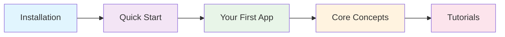

# Getting Started

Welcome to Celestra! This section will help you get up and running quickly with our powerful Domain-Specific Language for Kubernetes.

## What You'll Learn

<div class="grid cards" markdown>

-   :material-download:{ .lg .middle } **[Installation](installation.md)**

    ---

    Install Celestra and set up your development environment

-   :material-rocket-launch:{ .lg .middle } **[Quick Start](quick-start.md)**

    ---

    Create your first application in just a few minutes

-   :material-application:{ .lg .middle } **[Your First App](first-app.md)**

    ---

    Build a complete web application with database

-   :material-brain:{ .lg .middle } **[Core Concepts](core-concepts.md)**

    ---

    Understand the fundamental concepts of Celestra

</div>

## Learning Path



## Prerequisites

Before you begin, make sure you have:

- **Python 3.8+** installed
- **Basic Kubernetes knowledge** (pods, services, deployments)
- **kubectl** configured (optional, for deployment)
- **Docker** (optional, for building images)

## Quick Overview

Celestra allows you to define Kubernetes applications using intuitive Python code:

```python
from celestra import App, StatefulApp

# Define a web application
web_app = (App("my-web-app")
    .image("nginx:latest")
    .port(8080)
    .replicas(3)
    .expose())

# Add a database
database = (StatefulApp("postgres")
    .image("postgres:13")
    .env("POSTGRES_DB", "myapp")
    .storage("/data", "10Gi"))

# Generate Kubernetes YAML
resources = web_app.generate_kubernetes_resources()
db_resources = database.generate_kubernetes_resources()
```

## Why Celestra?

### ✨ **Intuitive Syntax**
Write infrastructure as code with clear, readable Python syntax that's easy to understand and maintain.

### 🔄 **Multiple Outputs**
Generate Kubernetes YAML, Helm charts, Docker Compose, Kustomize, and Terraform from the same codebase.

### 🛡️ **Production Ready**
Built-in security best practices, validation, and enterprise features for production deployments.

### 🧪 **Fully Tested**
223 comprehensive tests ensure reliability and correctness of your deployments.

### 📚 **Rich Ecosystem**
Extensive documentation, examples, and community resources to help you succeed.

## Next Steps

Ready to get started? Follow our step-by-step guide:

1. **[Install Celestra](installation.md)** - Set up your environment
2. **[Quick Start](quick-start.md)** - Build your first app
3. **[Core Concepts](core-concepts.md)** - Understand the fundamentals
4. **[Tutorials](../tutorials/index.md)** - Dive deeper with guided examples

## Need Help?

- 📖 **Documentation**: Browse our comprehensive guides
- 💬 **Community**: Join discussions on GitHub
- 🐛 **Issues**: Report bugs or request features
- 📧 **Support**: Get help from our team

---

**Let's build something amazing together!** Start with [installation](installation.md) or jump right into the [quick start guide](quick-start.md). 