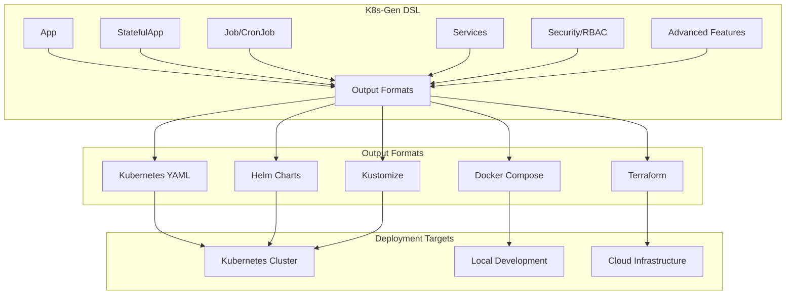

# K8s-Gen DSL Documentation

Welcome to the complete guide for **K8s-Gen**, a powerful Domain-Specific Language (DSL) for generating Kubernetes manifests, Helm charts, Docker Compose files, and more.


## 🚀 What is K8s-Gen?

K8s-Gen is a Python-based DSL that simplifies Kubernetes application deployment by providing:

- **Intuitive API** - Write infrastructure as code with clear, readable syntax
- **Multiple Output Formats** - Generate Kubernetes YAML, Helm charts, Docker Compose, Kustomize, and Terraform
- **Production Ready** - Built-in security, validation, and best practices
- **Comprehensive Testing** - 223 test cases ensuring reliability

## ⚡ Quick Example

```python
from k8s_gen import App, StatefulApp, Service

# Create a web application
web_app = (App("my-web-app")
    .image("nginx:1.21")
    .port(80, "http")
    .replicas(3)
    .resources(cpu="500m", memory="512Mi")
    .expose())

# Create a database
database = (StatefulApp("postgres")
    .image("postgres:13")
    .port(5432, "postgres")
    .env("POSTGRES_DB", "myapp")
    .storage("/var/lib/postgresql/data", "10Gi"))

# Generate Kubernetes YAML
resources = web_app.generate_kubernetes_resources()
db_resources = database.generate_kubernetes_resources()
```

## 🎯 Key Features

=== "Simple & Intuitive"

    ```python
    # Clean, readable syntax
    app = (App("my-app")
        .image("nginx:latest")
        .port(8080)
        .replicas(3)
        .expose())
    ```

=== "Multiple Outputs"

    ```python
    from k8s_gen.output import KubernetesOutput, HelmOutput, DockerComposeOutput
    
    # Generate different formats
    KubernetesOutput().generate(app, "k8s/")
    HelmOutput("my-chart").add_resource(app).generate("helm/")
    DockerComposeOutput().generate(app, "docker-compose.yml")
    ```

=== "Production Ready"

    ```python
    # Built-in security and validation
    from k8s_gen import SecurityPolicy, Validator
    
    policy = SecurityPolicy("strict").enable_rbac().pod_security_standards("restricted")
    validator = Validator().validate_resources(resources)
    ```

=== "Enterprise Features"

    ```python
    # Advanced capabilities
    from k8s_gen import Observability, CostOptimization
    
    observability = Observability("monitoring").enable_metrics().enable_tracing()
    cost_optimizer = CostOptimization("optimizer").resource_optimization()
    ```

## 🏗️ Architecture Overview



## 🎯 Use Cases

| Use Case | Description | Examples |
|----------|-------------|----------|
| **Web Applications** | Deploy scalable web apps with load balancing | [NGINX](examples/simple/nginx-app.md), [Node.js](examples/simple/nodejs-app.md) |
| **Databases** | Stateful database deployments with persistence | [PostgreSQL](examples/databases/postgresql.md), [MongoDB](examples/databases/mongodb.md) |
| **Message Queues** | Event streaming and messaging platforms | [Kafka](tutorials/kafka-deployment.md), [RabbitMQ](examples/messaging/rabbitmq.md) |
| **Microservices** | Complete microservices architectures | [E-commerce Platform](examples/platforms/ecommerce.md) |
| **Multi-Environment** | Dev/staging/production environments | [Environment Setup](tutorials/multi-environment.md) |
| **CI/CD Pipelines** | Automated deployment pipelines | [CI/CD Example](examples/platforms/ci-cd-pipeline.md) |

## 🚀 Getting Started

<div class="grid cards" markdown>

-   :material-clock-fast:{ .lg .middle } **Quick Start**

    ---

    Get up and running in minutes with our quick start guide

    [:octicons-arrow-right-24: Quick Start](getting-started/quick-start.md)

-   :material-book-open-page-variant:{ .lg .middle } **Tutorials**

    ---

    Step-by-step tutorials from basic apps to complex platforms

    [:octicons-arrow-right-24: Tutorials](tutorials/index.md)

-   :material-puzzle:{ .lg .middle } **Components**

    ---

    Learn about all available DSL components and their usage

    [:octicons-arrow-right-24: Components](components/index.md)

-   :material-code-braces:{ .lg .middle } **Examples**

    ---

    Ready-to-use examples for common deployment scenarios

    [:octicons-arrow-right-24: Examples](examples/index.md)

</div>

## 🌟 Popular Tutorials

<div class="grid cards" markdown>

-   **[Kafka Deployment](tutorials/kafka-deployment.md)**
    
    Deploy a production-ready Kafka cluster with ZooKeeper

-   **[Multi-Environment Setup](tutorials/multi-environment.md)**
    
    Configure dev, staging, and production environments

-   **[RBAC Security](tutorials/rbac-security.md)**
    
    Implement comprehensive security with RBAC

-   **[Microservices Platform](tutorials/microservices.md)**
    
    Build a complete microservices architecture

</div>

## 📊 Project Stats

- **223 Tests** - Comprehensive test coverage
- **11 Modules** - Core, Workloads, Networking, Security, and more
- **5 Output Formats** - Kubernetes, Helm, Docker Compose, Kustomize, Terraform
- **100% Success Rate** - All tests passing

## 🤝 Community & Support

- **GitHub Repository**: [github.com/your-username/k8s-gen](https://github.com/your-username/k8s-gen)
- **Issues & Discussions**: Use GitHub Issues for bug reports and feature requests
- **Examples Repository**: Find more examples in our [examples collection](examples/index.md)

## 📝 License

K8s-Gen is open source software licensed under the MIT License.

---

**Ready to get started?** Check out our [Quick Start Guide](getting-started/quick-start.md) or jump into the [Kafka Tutorial](tutorials/kafka-deployment.md)! 