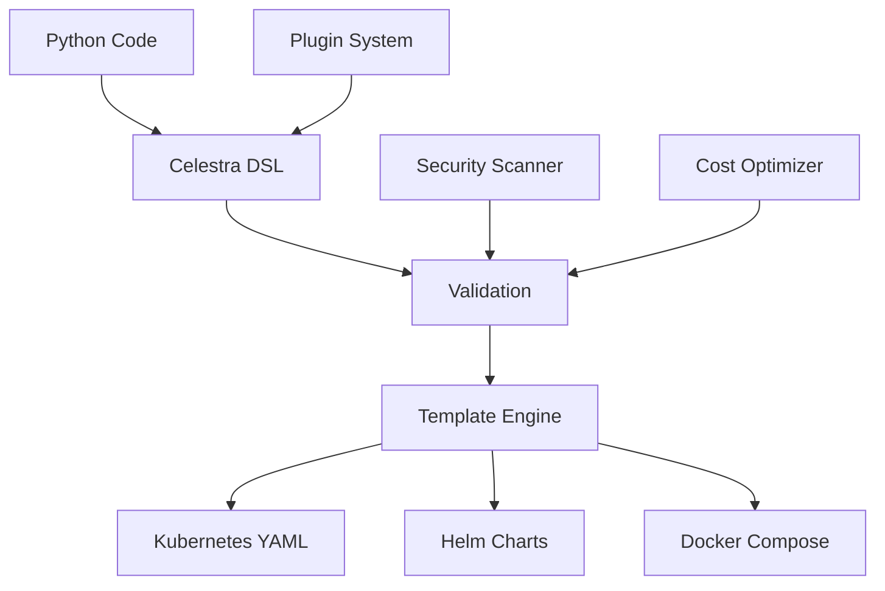

# Celestra

<div align="center">


<p><strong>Simplify Kubernetes deployments with Python</strong></p>

<p>
<a href="https://python.org"></a>
<a href="LICENSE"></a>
<a href="https://celestra.dev"></a>
</p>

</div>

---

## 🚀 What is Celestra?

Celestra is a **Domain-Specific Language (DSL)** for Kubernetes that lets you define infrastructure as code using Python. Instead of writing complex YAML, you write simple, readable Python code that generates production-ready Kubernetes manifests.

### ✨ Key Features

- **🎯 Simple Python API** - Write Kubernetes manifests in Python
- **🏗️ Multi-Format Output** - Generate YAML, Helm charts, Docker Compose
- **🔧 Comprehensive Components** - Apps, Services, Secrets, ConfigMaps, and more
- **🛡️ Built-in Security** - RBAC, Network Policies, Security Contexts
- **📊 Observability Ready** - Prometheus, Grafana, ELK stack integration
- **⚡ Production Ready** - High availability, scaling, health checks
- **🔌 Plugin System** - Extensible with custom plugins
- **🎨 Modern UI** - Beautiful documentation with dark theme

## 🎯 Quick Start

```python
from celestra import App

# Create a simple web application
app = (App("my-app")
    .image("nginx:latest")
    .port(80)
    .replicas(3)
    .resources(cpu="500m", memory="512Mi")
    .health_check("/health")
    .expose())

# Generate Kubernetes manifests
app.generate().to_yaml("./k8s/")
```

## 🏗️ Architecture

<div align="center">



</div>

## 🧩 Core Components

### Applications
- **[App](components/core/app.md)** - Stateless applications
- **[StatefulApp](components/core/stateful-app.md)** - Stateful applications
- **[AppGroup](components/core/app-group.md)** - Application groups

### Networking
- **[Service](components/networking/service.md)** - Service discovery
- **[Ingress](components/networking/ingress.md)** - External access
- **[Network Policy](components/networking/network-policy.md)** - Network security
- **[Scaling](components/networking/scaling.md)** - Autoscaling
- **[Health](components/networking/health.md)** - Health checks

### Security
- **[RBAC](components/security/rbac.md)** - Role-based access control
- **[Secrets](components/security/secrets.md)** - Sensitive data management
- **[Security Policy](components/security/security-policy.md)** - Pod security standards

### Storage
- **[ConfigMap](components/storage/config-map.md)** - Configuration management
- **[Volume](components/storage/volume.md)** - Persistent storage

### Workloads
- **[Deployment](components/workloads/deployment.md)** - Deployment management
- **[Job](components/workloads/job.md)** - Batch processing
- **[CronJob](components/workloads/cron-job.md)** - Scheduled jobs

### Advanced Features
- **[Observability](components/advanced/observability.md)** - Monitoring and logging
- **[Cost Optimization](components/advanced/cost-optimization.md)** - Resource optimization
- **[Plugin System](components/advanced/plugin-system.md)** - Custom extensions
- **[Advanced Features](components/advanced/advanced-features.md)** - Production features

## 📚 Documentation

### Getting Started
- **[Quick Start](getting-started/quick-start.md)** - Install and run your first app
- **[Installation](getting-started/installation.md)** - Setup and configuration
- **[Core Concepts](getting-started/core-concepts.md)** - Understanding Celestra

### Examples
- **[Hello World](examples/simple/hello-world.md)** - Your first application
- **[NGINX Web Server](examples/simple/nginx-app.md)** - Basic web server
- **[Node.js Application](examples/simple/nodejs-app.md)** - Full-stack app

### Tutorials
- **[Kafka Deployment](tutorials/kafka-deployment.md)** - Apache Kafka cluster
- **[Multi-Environment](tutorials/multi-environment.md)** - Dev/Staging/Prod
- **[Microservices](tutorials/microservices.md)** - Microservices architecture
- **[Observability Stack](tutorials/observability-stack.md)** - Monitoring setup

## 🎨 Features

### Modern Design
- **Dark Theme** - Easy on the eyes
- **Responsive Layout** - Works on all devices
- **Beautiful Typography** - Clean and readable
- **Syntax Highlighting** - Code examples with syntax highlighting
- **Search Functionality** - Find what you need quickly

### Developer Experience
- **Interactive Examples** - Copy-paste ready code
- **Step-by-step Guides** - Learn at your own pace
- **Component Reference** - Complete API documentation
- **Best Practices** - Production-ready patterns

## 🚀 Production Ready

Celestra is designed for production use with:

- **High Availability** - Multi-replica deployments
- **Auto Scaling** - Horizontal and vertical scaling
- **Health Monitoring** - Built-in health checks
- **Security First** - RBAC, network policies, security contexts
- **Cost Optimization** - Resource optimization and spot instances
- **Observability** - Metrics, logging, and tracing

## 🔌 Extensible

Build your own plugins and extensions:

```python
from celestra.plugins import PluginBase, PluginType

class MyCustomPlugin(PluginBase):
    def get_metadata(self):
        return PluginMetadata(
            name="my-custom-plugin",
            version="1.0.0",
            plugin_type=PluginType.VALIDATOR
        )
    
    def execute(self, context):
        # Your custom logic here
        return result
```

## 📊 Community

- **GitHub** - [Source Code](https://github.com/celestra/celestra)
- **Issues** - [Bug Reports](https://github.com/celestra/celestra/issues)
- **Discussions** - [Community Forum](https://github.com/celestra/celestra/discussions)
- **Contributing** - [Development Guide](CONTRIBUTING.md)

## 📄 License

This project is licensed under the MIT License - see the [LICENSE](LICENSE) file for details.

---

<div align="center">

<p><strong>Ready to simplify your Kubernetes deployments?</strong></p>

<p><a href="getting-started/quick-start.md">Get Started →</a></p>

</div> 