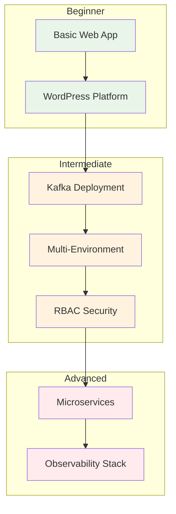

# Tutorials

Learn K8s-Gen DSL through hands-on tutorials that cover real-world scenarios from basic web applications to complex enterprise platforms.

## 🎯 Tutorial Categories

### 🚀 **Beginner Tutorials**

Perfect for getting started with K8s-Gen DSL:

-   **[Basic Web App](basic-web-app.md)**
    
    **⭐ Difficulty:** Easy | **⏱️ Time:** 10 minutes
    
    Build a simple web application with load balancing

-   **[WordPress Platform](wordpress-platform.md)**
    
    **⭐ Difficulty:** Easy | **⏱️ Time:** 15 minutes
    
    Deploy WordPress with MySQL database

### 🔥 **Popular Tutorials**

Most requested and widely used patterns:

-   **[Kafka Deployment](kafka-deployment.md)**
    
    **⭐⭐⭐ Difficulty:** Intermediate | **⏱️ Time:** 20 minutes
    
    Deploy production-ready Kafka cluster with ZooKeeper

-   **[Multi-Environment Setup](multi-environment.md)**
    
    **⭐⭐⭐ Difficulty:** Intermediate | **⏱️ Time:** 25 minutes
    
    Configure dev, staging, and production environments

-   **[RBAC Security](rbac-security.md)**
    
    **⭐⭐⭐ Difficulty:** Intermediate | **⏱️ Time:** 15 minutes
    
    Implement comprehensive security with RBAC

### 🏗️ **Advanced Tutorials**

For complex, production-ready systems:

-   **[Microservices Architecture](microservices.md)**
    
    **⭐⭐⭐⭐ Difficulty:** Advanced | **⏱️ Time:** 30 minutes
    
    Build complete microservices platform

-   **[Observability Stack](observability-stack.md)**
    
    **⭐⭐⭐⭐ Difficulty:** Advanced | **⏱️ Time:** 25 minutes
    
    Comprehensive monitoring, logging, and tracing

## 📚 Learning Path

## 🎯 Tutorials by Use Case

| Use Case | Tutorial | Complexity | Components Used |
|----------|----------|------------|-----------------|
| **Simple Website** | [Basic Web App](basic-web-app.md) | ⭐ | App, Service, Ingress |
| **CMS Platform** | [WordPress](wordpress-platform.md) | ⭐ | App, StatefulApp, Secret |
| **Message Streaming** | [Kafka Deployment](kafka-deployment.md) | ⭐⭐⭐ | StatefulApp, Service, ConfigMap |
| **Environment Management** | [Multi-Environment](multi-environment.md) | ⭐⭐⭐ | All Components |
| **Security & Access** | [RBAC Security](rbac-security.md) | ⭐⭐⭐ | RBAC, SecurityPolicy |
| **Distributed Systems** | [Microservices](microservices.md) | ⭐⭐⭐⭐ | AppGroup, Service Mesh |
| **Monitoring & Ops** | [Observability](observability-stack.md) | ⭐⭐⭐⭐ | Observability, Monitoring |

## 🔧 What You'll Learn

### Core Skills
- **Component Usage** - Master all K8s-Gen DSL components
- **Configuration** - Environment-specific configurations
- **Best Practices** - Production-ready patterns
- **Security** - Implement proper security measures

### Advanced Patterns
- **Service Mesh** - Inter-service communication
- **GitOps** - Automated deployment workflows  
- **Observability** - Monitoring and alerting
- **Scaling** - Auto-scaling and performance optimization

### Real-World Scenarios
- **Multi-tenancy** - Isolated environments
- **Disaster Recovery** - Backup and restoration
- **Cost Optimization** - Resource efficiency
- **Compliance** - Security and governance

## 🚀 Quick Start

New to K8s-Gen? Start here:

1. **[Basic Web App](basic-web-app.md)** - Learn the fundamentals
2. **[Kafka Deployment](kafka-deployment.md)** - Real-world application
3. **[Multi-Environment](multi-environment.md)** - Production patterns

Already familiar? Jump to:

- **[Microservices](microservices.md)** - Complex architectures
- **[Observability Stack](observability-stack.md)** - Monitoring setup

## 💡 Tutorial Format

Each tutorial follows a consistent structure:

### 📋 **Overview**
- Difficulty level and time estimate
- Prerequisites and learning objectives
- Architecture diagram of what you'll build

### 🛠️ **Step-by-Step Guide**
- Detailed code examples with explanations
- Best practices and common pitfalls
- Testing and validation steps

### 🚀 **Deployment**
- Kubernetes deployment instructions
- Verification and troubleshooting
- Next steps and related tutorials

### 💡 **Key Takeaways**
- Summary of concepts learned
- Links to related documentation
- Suggestions for further exploration

## 📖 Prerequisites

Before starting the tutorials, make sure you have:

- **K8s-Gen DSL installed** - See [installation guide](../getting-started/installation.md)
- **Basic Python knowledge** - Understanding of Python syntax
- **Kubernetes basics** - Familiarity with pods, services, deployments
- **kubectl configured** - For deploying to Kubernetes (optional)

## 🤝 Contributing

Found an issue or want to improve a tutorial?

- **Report Issues** - Use GitHub Issues for problems
- **Suggest Improvements** - Submit pull requests
- **Request Tutorials** - Let us know what you'd like to see
- **Share Examples** - Show us what you've built!

---

**Ready to start learning?** Begin with our [Basic Web App tutorial](basic-web-app.md) or dive into [Kafka deployment](kafka-deployment.md) for a real-world example! 