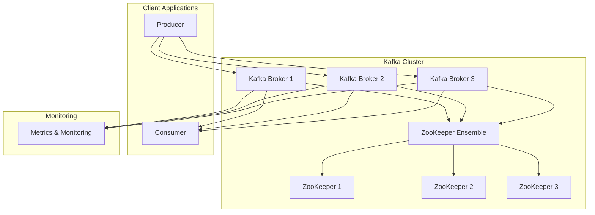

# Kafka Deployment Tutorial

Learn how to deploy a production-ready Apache Kafka cluster with ZooKeeper using K8s-Gen DSL. This tutorial covers everything from basic setup to advanced configurations.

!!! info "Tutorial Overview"
    **Difficulty**: ⭐⭐⭐ Intermediate  
    **Time**: 15-20 minutes  
    **Prerequisites**: Basic Kubernetes knowledge  
    **You'll Learn**: Kafka deployment, ZooKeeper setup, production configurations

## What We'll Build



## Step 1: Basic Kafka Setup

Let's start with a simple Kafka deployment:

```python
#!/usr/bin/env python3
"""
Basic Kafka Deployment with K8s-Gen DSL
"""

from src.k8s_gen import App, StatefulApp, Service, ConfigMap, KubernetesOutput
import os

def create_basic_kafka():
    print("🚀 Creating basic Kafka deployment...")
    
    # ZooKeeper for Kafka coordination
    zookeeper = (StatefulApp("zookeeper")
        .image("confluentinc/cp-zookeeper:7.4.0")
        .port(2181, "client")
        .port(2888, "follower")
        .port(3888, "election")
        .env("ZOOKEEPER_CLIENT_PORT", "2181")
        .env("ZOOKEEPER_TICK_TIME", "2000")
        .resources(cpu="100m", memory="256Mi")
        .storage("/var/lib/zookeeper/data", "1Gi")
        .replicas(1))  # Start with single instance
    
    # Kafka Broker
    kafka = (StatefulApp("kafka")
        .image("confluentinc/cp-kafka:7.4.0")
        .port(9092, "kafka")
        .port(9101, "jmx")
        .env("KAFKA_BROKER_ID", "1")
        .env("KAFKA_ZOOKEEPER_CONNECT", "zookeeper:2181")
        .env("KAFKA_LISTENER_SECURITY_PROTOCOL_MAP", "PLAINTEXT:PLAINTEXT,PLAINTEXT_HOST:PLAINTEXT")
        .env("KAFKA_ADVERTISED_LISTENERS", "PLAINTEXT://kafka:9092")
        .env("KAFKA_OFFSETS_TOPIC_REPLICATION_FACTOR", "1")
        .env("KAFKA_TRANSACTION_STATE_LOG_MIN_ISR", "1")
        .env("KAFKA_TRANSACTION_STATE_LOG_REPLICATION_FACTOR", "1")
        .env("KAFKA_JMX_PORT", "9101")
        .env("KAFKA_JMX_HOSTNAME", "localhost")
        .resources(cpu="500m", memory="1Gi")
        .storage("/var/lib/kafka/data", "10Gi")
        .replicas(1))
    
    return zookeeper, kafka

if __name__ == "__main__":
    zookeeper, kafka = create_basic_kafka()
    
    # Generate Kubernetes resources
    zk_resources = zookeeper.generate_kubernetes_resources()
    kafka_resources = kafka.generate_kubernetes_resources()
    
    # Output to files
    os.makedirs("kafka-basic", exist_ok=True)
    
    output = KubernetesOutput()
    output.generate(zookeeper, "kafka-basic/")
    output.generate(kafka, "kafka-basic/")
    
    print(f"✅ Generated basic Kafka deployment")
    print(f"📁 Files: kafka-basic/")
    print(f"🚀 Deploy: kubectl apply -f kafka-basic/")
```

## Step 2: Production Kafka Cluster

Now let's create a production-ready cluster with multiple brokers:

```python
#!/usr/bin/env python3
"""
Production Kafka Cluster with K8s-Gen DSL
"""

from src.k8s_gen import (
    StatefulApp, Service, ConfigMap, Secret, 
    ServiceAccount, NetworkPolicy, KubernetesOutput
)
import os

def create_production_kafka():
    print("🚀 Creating production Kafka cluster...")
    
    # ZooKeeper Ensemble (3 nodes for HA)
    zookeeper = (StatefulApp("zookeeper")
        .image("confluentinc/cp-zookeeper:7.4.0")
        .port(2181, "client")
        .port(2888, "follower") 
        .port(3888, "election")
        .env("ZOOKEEPER_CLIENT_PORT", "2181")
        .env("ZOOKEEPER_TICK_TIME", "2000")
        .env("ZOOKEEPER_INIT_LIMIT", "5")
        .env("ZOOKEEPER_SYNC_LIMIT", "2")
        .env("ZOOKEEPER_SERVERS", "zookeeper-0.zookeeper:2888:3888;zookeeper-1.zookeeper:2888:3888;zookeeper-2.zookeeper:2888:3888")
        .resources(cpu="500m", memory="512Mi")
        .storage("/var/lib/zookeeper/data", "2Gi")
        .storage("/var/lib/zookeeper/log", "1Gi", mount_path="/var/lib/zookeeper/log")
        .replicas(3))  # HA setup
    
    # Kafka Cluster (3 brokers)
    kafka = (StatefulApp("kafka")
        .image("confluentinc/cp-kafka:7.4.0")
        .port(9092, "kafka")
        .port(9093, "kafka-ssl")
        .port(9101, "jmx")
        .env("KAFKA_ZOOKEEPER_CONNECT", "zookeeper-0.zookeeper:2181,zookeeper-1.zookeeper:2181,zookeeper-2.zookeeper:2181")
        .env("KAFKA_LISTENER_SECURITY_PROTOCOL_MAP", "PLAINTEXT:PLAINTEXT,SSL:SSL,PLAINTEXT_HOST:PLAINTEXT")
        .env("KAFKA_ADVERTISED_LISTENERS", "PLAINTEXT://kafka-$(POD_NAME).kafka:9092")
        .env("KAFKA_AUTO_CREATE_TOPICS_ENABLE", "false")
        .env("KAFKA_DEFAULT_REPLICATION_FACTOR", "3")
        .env("KAFKA_MIN_INSYNC_REPLICAS", "2")
        .env("KAFKA_OFFSETS_TOPIC_REPLICATION_FACTOR", "3")
        .env("KAFKA_TRANSACTION_STATE_LOG_REPLICATION_FACTOR", "3")
        .env("KAFKA_TRANSACTION_STATE_LOG_MIN_ISR", "2")
        .env("KAFKA_LOG_RETENTION_HOURS", "168")  # 7 days
        .env("KAFKA_LOG_RETENTION_BYTES", "1073741824")  # 1GB per partition
        .env("KAFKA_LOG_SEGMENT_BYTES", "1073741824")
        .env("KAFKA_JMX_PORT", "9101")
        .env("KAFKA_JMX_HOSTNAME", "localhost")
        .env("KAFKA_HEAP_OPTS", "-Xmx1G -Xms1G")
        .resources(cpu="1000m", memory="2Gi")
        .storage("/var/lib/kafka/data", "50Gi")
        .replicas(3))
    
    # Kafka Manager for cluster management
    kafka_manager = (App("kafka-manager")
        .image("hlebalbau/kafka-manager:stable")
        .port(9000, "web")
        .env("ZK_HOSTS", "zookeeper-0.zookeeper:2181,zookeeper-1.zookeeper:2181,zookeeper-2.zookeeper:2181")
        .env("APPLICATION_SECRET", "letmein")
        .resources(cpu="100m", memory="256Mi")
        .replicas(1)
        .expose())
    
    return zookeeper, kafka, kafka_manager

def create_kafka_topics_job():
    """Create a Job to initialize Kafka topics"""
    from src.k8s_gen import Job
    
    topics_job = (Job("kafka-topics-setup")
        .image("confluentinc/cp-kafka:7.4.0")
        .command([
            "sh", "-c", """
            # Wait for Kafka to be ready
            until kafka-topics --bootstrap-server kafka-0.kafka:9092 --list; do
                echo "Waiting for Kafka..."
                sleep 5
            done
            
            # Create topics
            kafka-topics --bootstrap-server kafka-0.kafka:9092 --create --topic user-events --partitions 12 --replication-factor 3 --if-not-exists
            kafka-topics --bootstrap-server kafka-0.kafka:9092 --create --topic order-events --partitions 6 --replication-factor 3 --if-not-exists
            kafka-topics --bootstrap-server kafka-0.kafka:9092 --create --topic notifications --partitions 3 --replication-factor 3 --if-not-exists
            
            echo "Topics created successfully!"
            """
        ])
        .resources(cpu="100m", memory="128Mi")
        .retry_limit(3))
    
    return topics_job

if __name__ == "__main__":
    zookeeper, kafka, kafka_manager = create_production_kafka()
    topics_job = create_kafka_topics_job()
    
    # Generate all resources
    components = [zookeeper, kafka, kafka_manager, topics_job]
    
    os.makedirs("kafka-production", exist_ok=True)
    
    output = KubernetesOutput()
    for component in components:
        output.generate(component, "kafka-production/")
    
    print(f"✅ Generated production Kafka cluster")
    print(f"📁 Files: kafka-production/")
    print(f"🚀 Deploy: kubectl apply -f kafka-production/")
    print(f"🌐 Access Kafka Manager: kubectl port-forward svc/kafka-manager 9000:9000")
```

## Step 3: Kafka with Security (SASL/SSL)

Add security with authentication and encryption:

```python
#!/usr/bin/env python3
"""
Secure Kafka Deployment with SASL/SSL
"""

from src.k8s_gen import StatefulApp, Secret, ConfigMap, KubernetesOutput
import os

def create_secure_kafka():
    print("🔐 Creating secure Kafka cluster...")
    
    # Create JAAS configuration for SASL
    jaas_config = ConfigMap("kafka-jaas-config")
    jaas_config.add_data("kafka_server_jaas.conf", """
KafkaServer {
    org.apache.kafka.common.security.plain.PlainLoginModule required
    username="admin"
    password="admin-secret"
    user_admin="admin-secret"
    user_producer="producer-secret"
    user_consumer="consumer-secret";
};

Client {
    org.apache.kafka.common.security.plain.PlainLoginModule required
    username="admin"
    password="admin-secret";
};
""")
    
    # SSL Certificates (in production, use cert-manager or external certs)
    ssl_secret = Secret("kafka-ssl-certs")
    ssl_secret.add_data("kafka.keystore.jks", "base64-encoded-keystore")
    ssl_secret.add_data("kafka.truststore.jks", "base64-encoded-truststore")
    ssl_secret.add_data("keystore-password", "keystore-password")
    ssl_secret.add_data("truststore-password", "truststore-password")
    
    # Secure ZooKeeper
    zookeeper = (StatefulApp("zookeeper")
        .image("confluentinc/cp-zookeeper:7.4.0")
        .port(2181, "client")
        .port(2182, "secure-client")
        .env("ZOOKEEPER_CLIENT_PORT", "2181")
        .env("ZOOKEEPER_SECURE_CLIENT_PORT", "2182")
        .env("ZOOKEEPER_TICK_TIME", "2000")
        .env("ZOOKEEPER_SASL_ENABLED", "true")
        .env("ZOOKEEPER_REQUIRE_CLIENT_AUTH", "false")
        .env("KAFKA_OPTS", "-Djava.security.auth.login.config=/etc/kafka/secrets/kafka_server_jaas.conf")
        .resources(cpu="500m", memory="512Mi")
        .storage("/var/lib/zookeeper/data", "2Gi")
        .replicas(3))
    
    # Secure Kafka
    kafka = (StatefulApp("kafka")
        .image("confluentinc/cp-kafka:7.4.0")
        .port(9092, "plaintext")
        .port(9093, "ssl") 
        .port(9094, "sasl-ssl")
        .port(9101, "jmx")
        .env("KAFKA_ZOOKEEPER_CONNECT", "zookeeper:2181")
        .env("KAFKA_LISTENER_SECURITY_PROTOCOL_MAP", "PLAINTEXT:PLAINTEXT,SSL:SSL,SASL_SSL:SASL_SSL")
        .env("KAFKA_ADVERTISED_LISTENERS", "PLAINTEXT://kafka:9092,SSL://kafka:9093,SASL_SSL://kafka:9094")
        .env("KAFKA_SECURITY_INTER_BROKER_PROTOCOL", "SASL_SSL")
        .env("KAFKA_SASL_MECHANISM_INTER_BROKER_PROTOCOL", "PLAIN")
        .env("KAFKA_SASL_ENABLED_MECHANISMS", "PLAIN")
        .env("KAFKA_SSL_KEYSTORE_FILENAME", "kafka.keystore.jks")
        .env("KAFKA_SSL_KEYSTORE_CREDENTIALS", "keystore-password")
        .env("KAFKA_SSL_KEY_CREDENTIALS", "keystore-password")
        .env("KAFKA_SSL_TRUSTSTORE_FILENAME", "kafka.truststore.jks")
        .env("KAFKA_SSL_TRUSTSTORE_CREDENTIALS", "truststore-password")
        .env("KAFKA_SSL_CLIENT_AUTH", "none")
        .env("KAFKA_OPTS", "-Djava.security.auth.login.config=/etc/kafka/secrets/kafka_server_jaas.conf")
        .env("KAFKA_OFFSETS_TOPIC_REPLICATION_FACTOR", "3")
        .env("KAFKA_TRANSACTION_STATE_LOG_REPLICATION_FACTOR", "3")
        .env("KAFKA_TRANSACTION_STATE_LOG_MIN_ISR", "2")
        .resources(cpu="1000m", memory="2Gi")
        .storage("/var/lib/kafka/data", "50Gi")
        .replicas(3))
    
    return zookeeper, kafka, jaas_config, ssl_secret

if __name__ == "__main__":
    zookeeper, kafka, jaas_config, ssl_secret = create_secure_kafka()
    
    components = [jaas_config, ssl_secret, zookeeper, kafka]
    
    os.makedirs("kafka-secure", exist_ok=True)
    
    output = KubernetesOutput()
    for component in components:
        output.generate(component, "kafka-secure/")
    
    print(f"🔐 Generated secure Kafka cluster")
    print(f"📁 Files: kafka-secure/")
    print(f"🚀 Deploy: kubectl apply -f kafka-secure/")
```

## Step 4: Monitoring and Observability

Add comprehensive monitoring to your Kafka cluster:

```python
#!/usr/bin/env python3
"""
Kafka with Monitoring and Observability
"""

from src.k8s_gen import App, StatefulApp, ConfigMap, Service, KubernetesOutput
import os

def create_kafka_with_monitoring():
    print("📊 Creating Kafka cluster with monitoring...")
    
    # Kafka JMX Exporter Configuration
    jmx_config = ConfigMap("kafka-jmx-config")
    jmx_config.add_data("kafka-jmx.yml", """
rules:
  - pattern: "kafka.server<type=(.+), name=(.+)><>Value"
    name: kafka_server_$1_$2
  - pattern: "kafka.server<type=(.+), name=(.+), clientId=(.+)><>Value"
    name: kafka_server_$1_$2
    labels:
      clientId: "$3"
  - pattern: "kafka.server<type=(.+), name=(.+), topic=(.+)><>Value"
    name: kafka_server_$1_$2
    labels:
      topic: "$3"
""")
    
    # Kafka with JMX metrics
    kafka = (StatefulApp("kafka")
        .image("confluentinc/cp-kafka:7.4.0")
        .port(9092, "kafka")
        .port(9101, "jmx")
        .port(9308, "metrics")  # Prometheus metrics
        .env("KAFKA_ZOOKEEPER_CONNECT", "zookeeper:2181")
        .env("KAFKA_ADVERTISED_LISTENERS", "PLAINTEXT://kafka:9092")
        .env("KAFKA_JMX_PORT", "9101")
        .env("KAFKA_JMX_HOSTNAME", "localhost")
        .env("KAFKA_OPTS", "-javaagent:/opt/jmx_prometheus_javaagent.jar=9308:/etc/jmx-exporter/kafka-jmx.yml")
        .resources(cpu="1000m", memory="2Gi")
        .storage("/var/lib/kafka/data", "50Gi")
        .replicas(3))
    
    # Kafka Exporter for additional metrics
    kafka_exporter = (App("kafka-exporter")
        .image("danielqsj/kafka-exporter:latest")
        .port(9308, "metrics")
        .command(["./kafka_exporter", "--kafka.server=kafka:9092"])
        .resources(cpu="100m", memory="128Mi")
        .replicas(1))
    
    # Grafana for visualization
    grafana = (App("grafana")
        .image("grafana/grafana:9.5.0")
        .port(3000, "web")
        .env("GF_SECURITY_ADMIN_PASSWORD", "admin")
        .env("GF_INSTALL_PLUGINS", "grafana-piechart-panel")
        .resources(cpu="200m", memory="256Mi")
        .storage("/var/lib/grafana", "1Gi")
        .expose())
    
    # Prometheus for metrics collection
    prometheus = (App("prometheus")
        .image("prom/prometheus:v2.44.0")
        .port(9090, "web")
        .resources(cpu="500m", memory="1Gi")
        .storage("/prometheus", "10Gi")
        .expose())
    
    return kafka, kafka_exporter, grafana, prometheus, jmx_config

if __name__ == "__main__":
    kafka, kafka_exporter, grafana, prometheus, jmx_config = create_kafka_with_monitoring()
    
    components = [jmx_config, kafka, kafka_exporter, grafana, prometheus]
    
    os.makedirs("kafka-monitoring", exist_ok=True)
    
    output = KubernetesOutput()
    for component in components:
        output.generate(component, "kafka-monitoring/")
    
    print(f"📊 Generated Kafka cluster with monitoring")
    print(f"📁 Files: kafka-monitoring/")
    print(f"🚀 Deploy: kubectl apply -f kafka-monitoring/")
    print(f"📊 Grafana: kubectl port-forward svc/grafana 3000:3000")
    print(f"📈 Prometheus: kubectl port-forward svc/prometheus 9090:9090")
```

## Step 5: Complete Production Example

Here's a complete production example with all features:

```python
#!/usr/bin/env python3
"""
Complete Production Kafka Platform
"""

from src.k8s_gen import *
import os

def create_complete_kafka_platform():
    print("🏗️ Creating complete Kafka platform...")
    
    # Namespace for isolation
    namespace = "kafka-platform"
    
    # Service Account with minimal permissions
    service_account = ServiceAccount("kafka-service-account")
    
    # Network Policy for security
    network_policy = (NetworkPolicy("kafka-network-policy")
        .allow_ingress_from_pods({"app": "kafka"})
        .allow_egress_to_pods({"app": "zookeeper"}))
    
    # ZooKeeper Ensemble
    zookeeper = (StatefulApp("zookeeper")
        .image("confluentinc/cp-zookeeper:7.4.0")
        .namespace(namespace)
        .service_account(service_account)
        .port(2181, "client")
        .port(2888, "follower")
        .port(3888, "election")
        .env("ZOOKEEPER_CLIENT_PORT", "2181")
        .env("ZOOKEEPER_TICK_TIME", "2000")
        .env("ZOOKEEPER_SERVERS", "zookeeper-0.zookeeper:2888:3888;zookeeper-1.zookeeper:2888:3888;zookeeper-2.zookeeper:2888:3888")
        .resources(cpu="500m", memory="1Gi", cpu_limit="1000m", memory_limit="2Gi")
        .storage("/var/lib/zookeeper/data", "5Gi")
        .replicas(3)
        .liveness_probe("/health", port=2181, initial_delay=30)
        .readiness_probe("/ready", port=2181, initial_delay=10))
    
    # Kafka Cluster
    kafka = (StatefulApp("kafka")
        .image("confluentinc/cp-kafka:7.4.0")
        .namespace(namespace)
        .service_account(service_account)
        .port(9092, "kafka")
        .port(9101, "jmx")
        .port(9308, "metrics")
        .env("KAFKA_ZOOKEEPER_CONNECT", "zookeeper:2181")
        .env("KAFKA_ADVERTISED_LISTENERS", "PLAINTEXT://kafka:9092")
        .env("KAFKA_AUTO_CREATE_TOPICS_ENABLE", "false")
        .env("KAFKA_DEFAULT_REPLICATION_FACTOR", "3")
        .env("KAFKA_MIN_INSYNC_REPLICAS", "2")
        .env("KAFKA_NUM_NETWORK_THREADS", "8")
        .env("KAFKA_NUM_IO_THREADS", "8")
        .env("KAFKA_SOCKET_SEND_BUFFER_BYTES", "102400")
        .env("KAFKA_SOCKET_RECEIVE_BUFFER_BYTES", "102400")
        .env("KAFKA_SOCKET_REQUEST_MAX_BYTES", "104857600")
        .env("KAFKA_LOG_RETENTION_HOURS", "168")
        .env("KAFKA_LOG_SEGMENT_BYTES", "1073741824")
        .env("KAFKA_JMX_PORT", "9101")
        .env("KAFKA_HEAP_OPTS", "-Xmx2G -Xms2G")
        .resources(cpu="1000m", memory="3Gi", cpu_limit="2000m", memory_limit="4Gi")
        .storage("/var/lib/kafka/data", "100Gi")
        .replicas(3)
        .liveness_probe("/health", port=9092, initial_delay=60)
        .readiness_probe("/ready", port=9092, initial_delay=30))
    
    # Schema Registry
    schema_registry = (App("schema-registry")
        .image("confluentinc/cp-schema-registry:7.4.0")
        .namespace(namespace)
        .port(8081, "api")
        .env("SCHEMA_REGISTRY_HOST_NAME", "schema-registry")
        .env("SCHEMA_REGISTRY_KAFKASTORE_BOOTSTRAP_SERVERS", "kafka:9092")
        .env("SCHEMA_REGISTRY_LISTENERS", "http://0.0.0.0:8081")
        .resources(cpu="200m", memory="512Mi")
        .replicas(2)
        .expose())
    
    # Kafka Connect
    kafka_connect = (App("kafka-connect")
        .image("confluentinc/cp-kafka-connect:7.4.0")
        .namespace(namespace)
        .port(8083, "api")
        .env("CONNECT_BOOTSTRAP_SERVERS", "kafka:9092")
        .env("CONNECT_REST_ADVERTISED_HOST_NAME", "kafka-connect")
        .env("CONNECT_REST_PORT", "8083")
        .env("CONNECT_GROUP_ID", "compose-connect-group")
        .env("CONNECT_CONFIG_STORAGE_TOPIC", "docker-connect-configs")
        .env("CONNECT_OFFSET_STORAGE_TOPIC", "docker-connect-offsets")
        .env("CONNECT_STATUS_STORAGE_TOPIC", "docker-connect-status")
        .env("CONNECT_KEY_CONVERTER", "org.apache.kafka.connect.storage.StringConverter")
        .env("CONNECT_VALUE_CONVERTER", "io.confluent.connect.avro.AvroConverter")
        .env("CONNECT_VALUE_CONVERTER_SCHEMA_REGISTRY_URL", "http://schema-registry:8081")
        .resources(cpu="500m", memory="1Gi")
        .replicas(2)
        .expose())
    
    # KSQL Server
    ksql_server = (App("ksql-server")
        .image("confluentinc/cp-ksqldb-server:7.4.0")
        .namespace(namespace)
        .port(8088, "api")
        .env("KSQL_CONFIG_DIR", "/etc/ksql")
        .env("KSQL_BOOTSTRAP_SERVERS", "kafka:9092")
        .env("KSQL_HOST_NAME", "ksql-server")
        .env("KSQL_LISTENERS", "http://0.0.0.0:8088")
        .env("KSQL_CACHE_MAX_BYTES_BUFFERING", "0")
        .env("KSQL_KSQL_SCHEMA_REGISTRY_URL", "http://schema-registry:8081")
        .resources(cpu="500m", memory="1Gi")
        .replicas(2)
        .expose())
    
    return {
        "zookeeper": zookeeper,
        "kafka": kafka,
        "schema_registry": schema_registry,
        "kafka_connect": kafka_connect,
        "ksql_server": ksql_server,
        "service_account": service_account,
        "network_policy": network_policy
    }

if __name__ == "__main__":
    components = create_complete_kafka_platform()
    
    os.makedirs("kafka-platform", exist_ok=True)
    
    output = KubernetesOutput()
    for name, component in components.items():
        output.generate(component, "kafka-platform/")
    
    print(f"🏗️ Generated complete Kafka platform")
    print(f"📁 Files: kafka-platform/")
    print(f"🚀 Deploy: kubectl apply -f kafka-platform/")
    print(f"\n🌐 Access Services:")
    print(f"   Schema Registry: kubectl port-forward svc/schema-registry 8081:8081")
    print(f"   Kafka Connect: kubectl port-forward svc/kafka-connect 8083:8083")
    print(f"   KSQL Server: kubectl port-forward svc/ksql-server 8088:8088")
```

## Deployment and Testing

### Deploy Your Kafka Cluster

```bash
# Create namespace
kubectl create namespace kafka-platform

# Deploy the cluster
kubectl apply -f kafka-platform/

# Wait for pods to be ready
kubectl wait --for=condition=ready pod -l app=kafka -n kafka-platform --timeout=300s
kubectl wait --for=condition=ready pod -l app=zookeeper -n kafka-platform --timeout=300s
```

### Test Your Kafka Cluster

```bash
# Create a test topic
kubectl exec -it kafka-0 -n kafka-platform -- kafka-topics \
  --bootstrap-server localhost:9092 \
  --create \
  --topic test-topic \
  --partitions 3 \
  --replication-factor 3

# Produce messages
kubectl exec -it kafka-0 -n kafka-platform -- kafka-console-producer \
  --bootstrap-server localhost:9092 \
  --topic test-topic

# Consume messages (in another terminal)
kubectl exec -it kafka-0 -n kafka-platform -- kafka-console-consumer \
  --bootstrap-server localhost:9092 \
  --topic test-topic \
  --from-beginning
```

## Next Steps

🎯 **Congratulations!** You now have a production-ready Kafka cluster. Here's what to explore next:

- **[Multi-Environment Setup](multi-environment.md)** - Deploy across dev/staging/prod
- **[RBAC Security](rbac-security.md)** - Add role-based access control
- **[Observability Stack](observability-stack.md)** - Enhanced monitoring and alerting
- **[Advanced Configuration](../configuration/multi-environment.md)** - Fine-tune your cluster

## Best Practices

!!! tip "Production Recommendations"
    - Use at least 3 Kafka brokers for high availability
    - Set appropriate replication factors (3 for production)
    - Configure proper resource limits and requests
    - Enable monitoring and alerting
    - Use persistent storage for data durability
    - Implement proper security (SASL/SSL)
    - Regular backup and disaster recovery planning

---

**Need help?** Check out our [examples](../examples/messaging/kafka.md) or [troubleshooting guide](../advanced/best-practices.md)! 